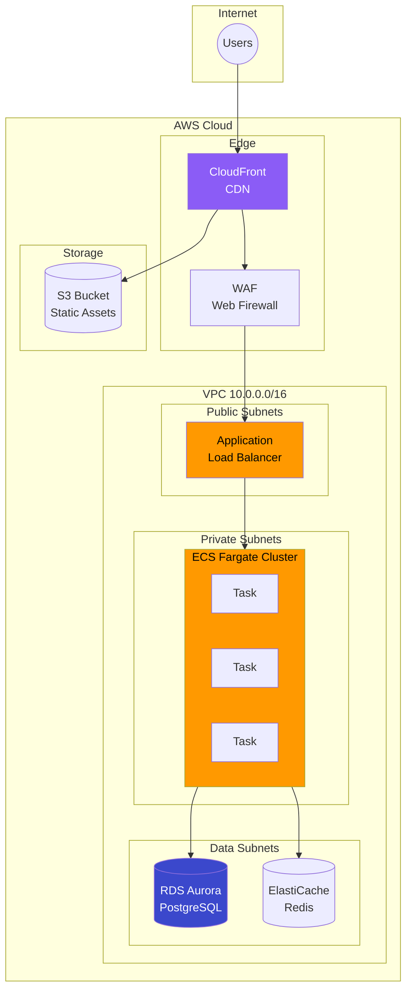
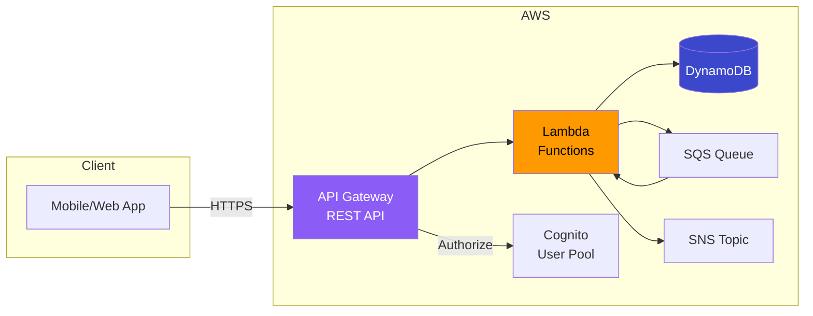
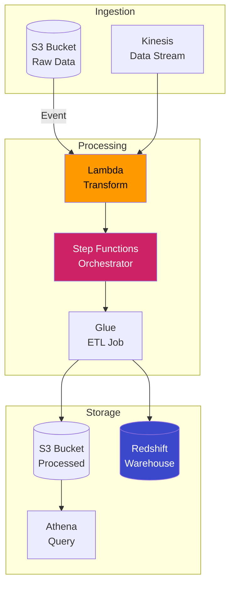

# AWS CDK Patterns

[](https://github.com/morgandt-reed/aws-cdk-patterns/actions/workflows/ci.yml)
[](https://opensource.org/licenses/MIT)
[](https://aws.amazon.com/cdk/)
[](https://www.typescriptlang.org/)

Production-ready AWS CDK patterns demonstrating infrastructure as code with TypeScript for common cloud architectures.

## Architecture Patterns

### Three-Tier Web Application



### Serverless API Pattern



### Event-Driven Processing



## Features

- **Type-Safe Infrastructure**: TypeScript with full IDE support
- **Reusable Constructs**: Modular, composable patterns
- **Best Practices**: Security, cost optimization, high availability
- **Multi-Environment**: Dev, staging, production configurations
- **CI/CD Ready**: GitHub Actions for deployment pipelines
- **Well-Documented**: Inline comments and architecture docs

## Tech Stack

- **CDK Version**: 2.120+
- **Language**: TypeScript 5.3
- **Node.js**: 20.x LTS
- **Testing**: Jest + CDK assertions
- **Linting**: ESLint + Prettier

## Project Structure

```
.
├── README.md
├── cdk.json
├── package.json
├── tsconfig.json
├── bin/
│   └── app.ts                    # CDK app entry point
├── lib/
│   ├── constructs/               # Reusable L3 constructs
│   │   ├── vpc-construct.ts
│   │   ├── ecs-service.ts
│   │   ├── rds-database.ts
│   │   └── lambda-api.ts
│   ├── stacks/                   # Application stacks
│   │   ├── network-stack.ts
│   │   ├── database-stack.ts
│   │   ├── compute-stack.ts
│   │   └── serverless-stack.ts
│   └── config/
│       └── environments.ts       # Environment configurations
├── test/
│   ├── constructs/
│   └── stacks/
└── .github/
    └── workflows/
        └── ci.yml
```

## Quick Start

### Prerequisites

- Node.js 20.x
- AWS CLI configured
- AWS CDK CLI: `npm install -g aws-cdk`

### Installation

```bash
# Clone repository
git clone https://github.com/morgandt-reed/aws-cdk-patterns.git
cd aws-cdk-patterns

# Install dependencies
npm install

# Bootstrap CDK (first time only)
cdk bootstrap aws://ACCOUNT_ID/REGION

# Synthesize CloudFormation
cdk synth

# Deploy
cdk deploy --all
```

### Development Commands

```bash
# Build TypeScript
npm run build

# Run tests
npm test

# Watch mode
npm run watch

# Lint
npm run lint

# CDK commands
cdk diff       # Show changes
cdk deploy     # Deploy stacks
cdk destroy    # Tear down
```

## Patterns Included

### 1. VPC with Best Practices

Multi-AZ VPC with public, private, and isolated subnets.

```typescript
import { VpcConstruct } from './constructs/vpc-construct';

const vpc = new VpcConstruct(this, 'Vpc', {
  maxAzs: 3,
  natGateways: 1,  // Cost optimization for non-prod
  enableFlowLogs: true,
});
```

**Features:**
- 3 subnet tiers (public, private, isolated)
- NAT Gateway with cost optimization options
- VPC Flow Logs to CloudWatch
- VPC Endpoints for AWS services

### 2. ECS Fargate Service

Containerized application on ECS Fargate with auto-scaling.

```typescript
import { EcsService } from './constructs/ecs-service';

const service = new EcsService(this, 'Api', {
  vpc,
  image: 'my-app:latest',
  cpu: 256,
  memory: 512,
  desiredCount: 2,
  scaling: {
    minCapacity: 2,
    maxCapacity: 10,
    targetCpuUtilization: 70,
  },
});
```

**Features:**
- Fargate Spot for cost savings
- Auto-scaling based on CPU/memory
- Application Load Balancer integration
- Secrets Manager integration
- CloudWatch Container Insights

### 3. Aurora Serverless Database

Serverless PostgreSQL with automatic scaling.

```typescript
import { RdsDatabase } from './constructs/rds-database';

const database = new RdsDatabase(this, 'Database', {
  vpc,
  engine: 'postgresql',
  serverless: true,
  scaling: {
    minCapacity: 0.5,  // ACUs
    maxCapacity: 16,
  },
  enableDataApi: true,
});
```

**Features:**
- Aurora Serverless v2
- Automatic backups with PITR
- Multi-AZ deployment
- Secrets rotation
- Performance Insights

### 4. Lambda API with API Gateway

Serverless REST API with Lambda handlers.

```typescript
import { LambdaApi } from './constructs/lambda-api';

const api = new LambdaApi(this, 'Api', {
  routes: [
    { path: '/users', method: 'GET', handler: 'handlers/users.list' },
    { path: '/users', method: 'POST', handler: 'handlers/users.create' },
    { path: '/users/{id}', method: 'GET', handler: 'handlers/users.get' },
  ],
  authorization: 'cognito',
  cors: true,
});
```

**Features:**
- REST API with OpenAPI spec
- Cognito or API Key authorization
- Request validation
- Lambda Powertools integration
- X-Ray tracing

### 5. Static Website with CloudFront

S3-hosted website with CloudFront CDN.

```typescript
import { StaticSite } from './constructs/static-site';

const site = new StaticSite(this, 'Website', {
  domainName: 'example.com',
  certificate: certificate,
  enableWaf: true,
  spaMode: true,  // Single Page Application
});
```

**Features:**
- S3 origin with OAC
- CloudFront distribution
- Custom domain with ACM certificate
- WAF protection
- Cache invalidation on deploy

## Environment Configuration

```typescript
// lib/config/environments.ts
export const environments = {
  dev: {
    account: '111111111111',
    region: 'us-west-2',
    vpc: {
      maxAzs: 2,
      natGateways: 1,
    },
    ecs: {
      desiredCount: 1,
      cpu: 256,
      memory: 512,
    },
  },
  prod: {
    account: '222222222222',
    region: 'us-east-1',
    vpc: {
      maxAzs: 3,
      natGateways: 3,
    },
    ecs: {
      desiredCount: 3,
      cpu: 1024,
      memory: 2048,
    },
  },
};
```

## Security Best Practices

### IAM Least Privilege

```typescript
// Grant specific permissions
bucket.grantRead(lambdaFunction);
table.grantReadWriteData(ecsTask.taskRole);

// Use managed policies sparingly
taskRole.addManagedPolicy(
  ManagedPolicy.fromAwsManagedPolicyName('AmazonSSMManagedInstanceCore')
);
```

### Secrets Management

```typescript
// Store in Secrets Manager
const secret = new Secret(this, 'DbSecret', {
  generateSecretString: {
    secretStringTemplate: JSON.stringify({ username: 'admin' }),
    generateStringKey: 'password',
    excludePunctuation: true,
  },
});

// Pass to container
container.addSecret('DB_PASSWORD', ecs.Secret.fromSecretsManager(secret));
```

### Network Security

```typescript
// Security groups with least privilege
dbSecurityGroup.addIngressRule(
  appSecurityGroup,
  ec2.Port.tcp(5432),
  'Allow app tier'
);

// VPC endpoints for private access
vpc.addInterfaceEndpoint('SecretsEndpoint', {
  service: ec2.InterfaceVpcEndpointAwsService.SECRETS_MANAGER,
});
```

## Cost Optimization

### Fargate Spot

```typescript
const service = new ecs.FargateService(this, 'Service', {
  capacityProviderStrategies: [
    { capacityProvider: 'FARGATE_SPOT', weight: 80 },
    { capacityProvider: 'FARGATE', weight: 20 },
  ],
});
```

### NAT Gateway Alternatives

```typescript
// Single NAT for dev
const vpc = new ec2.Vpc(this, 'Vpc', {
  natGateways: props.environment === 'prod' ? 3 : 1,
});

// Or use NAT instances
const natProvider = ec2.NatProvider.instance({
  instanceType: ec2.InstanceType.of(ec2.InstanceClass.T4G, ec2.InstanceSize.MICRO),
});
```

### Auto-Scaling to Zero

```typescript
// Aurora Serverless
const cluster = new rds.DatabaseCluster(this, 'Db', {
  serverlessV2MinCapacity: 0,  // Scale to zero
  serverlessV2MaxCapacity: 16,
});
```

## Testing

### Unit Tests

```typescript
import { Template } from 'aws-cdk-lib/assertions';
import { VpcConstruct } from '../lib/constructs/vpc-construct';

test('VPC has correct number of AZs', () => {
  const app = new cdk.App();
  const stack = new cdk.Stack(app, 'TestStack');

  new VpcConstruct(stack, 'Vpc', { maxAzs: 3 });

  const template = Template.fromStack(stack);
  template.resourceCountIs('AWS::EC2::Subnet', 9);  // 3 AZs * 3 tiers
});
```

### Snapshot Tests

```typescript
test('Stack matches snapshot', () => {
  const app = new cdk.App();
  const stack = new NetworkStack(app, 'Network');

  expect(Template.fromStack(stack).toJSON()).toMatchSnapshot();
});
```

## CI/CD Pipeline

```yaml
# .github/workflows/ci.yml
name: CDK Pipeline

on:
  push:
    branches: [main]
  pull_request:
    branches: [main]

jobs:
  build:
    runs-on: ubuntu-latest
    steps:
      - uses: actions/checkout@v4
      - uses: actions/setup-node@v4
        with:
          node-version: '20'

      - run: npm ci
      - run: npm run build
      - run: npm test
      - run: npx cdk synth

  deploy:
    if: github.ref == 'refs/heads/main'
    needs: build
    runs-on: ubuntu-latest
    steps:
      - uses: actions/checkout@v4
      - uses: aws-actions/configure-aws-credentials@v4
        with:
          role-to-assume: ${{ secrets.AWS_ROLE_ARN }}
          aws-region: us-west-2

      - run: npm ci
      - run: npx cdk deploy --all --require-approval never
```

## Trade-offs

### CDK vs Terraform

| Aspect | CDK | Terraform |
|--------|-----|-----------|
| Language | TypeScript/Python/Java | HCL |
| Abstraction | High-level constructs | Low-level resources |
| State | CloudFormation | Terraform state |
| Learning | Steeper (AWS concepts + CDK) | Moderate |
| Multi-cloud | AWS only | Multi-cloud |

### When to Use CDK

**Good fit:**
- Complex AWS-native applications
- Teams familiar with TypeScript/Python
- Need for custom constructs
- Want compile-time checking

**Consider alternatives:**
- Multi-cloud requirements
- Simple infrastructure
- Team prefers declarative syntax

## Resources

- [AWS CDK Documentation](https://docs.aws.amazon.com/cdk/latest/guide/)
- [CDK Patterns](https://cdkpatterns.com/)
- [AWS Solutions Constructs](https://docs.aws.amazon.com/solutions/latest/constructs/)
- [CDK Workshop](https://cdkworkshop.com/)

## License

MIT License - see [LICENSE](LICENSE) for details

---

**Built to demonstrate production-ready AWS CDK patterns for cloud-native applications.**
